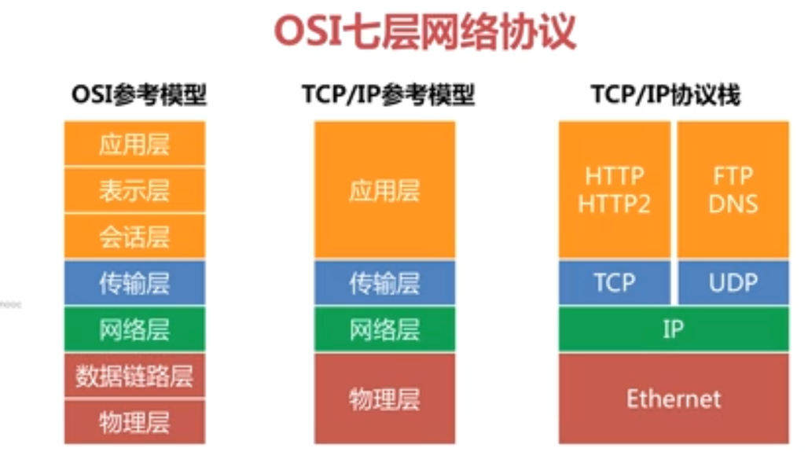
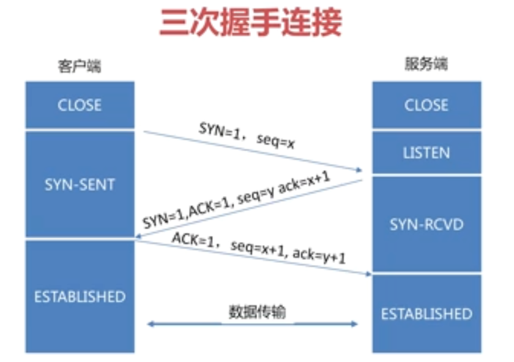
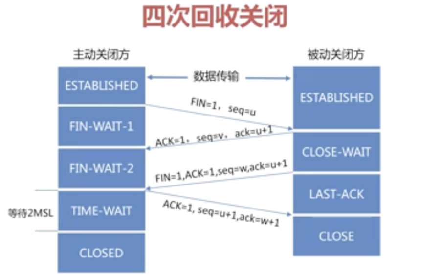

### 合并成一个字段

select concat(name, age) as info from user

### 去重

select DISTINCT concat(name, age) as info from user

mysql中的int(5) 并不是限制长度为5，而是显示的长度为5，实陨实际长度是不变的，int(5)和int(10)是一样的，只是显示长度不一样。

int

count(*)   // 获取的是所有记录
count(class_id)  // 获取的是id不等于null的

