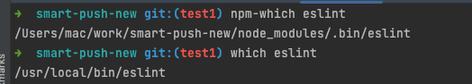
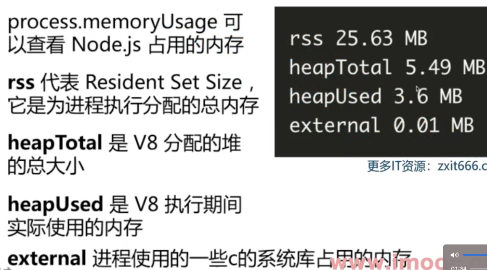
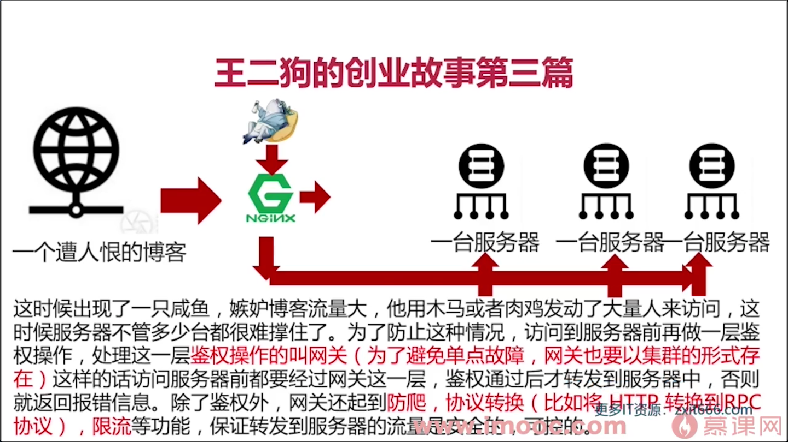
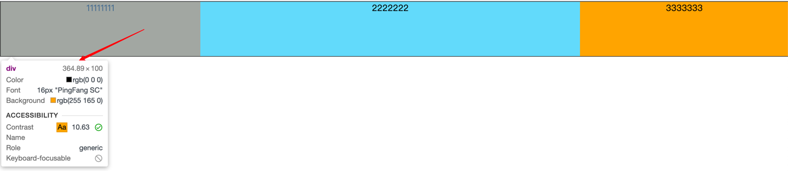
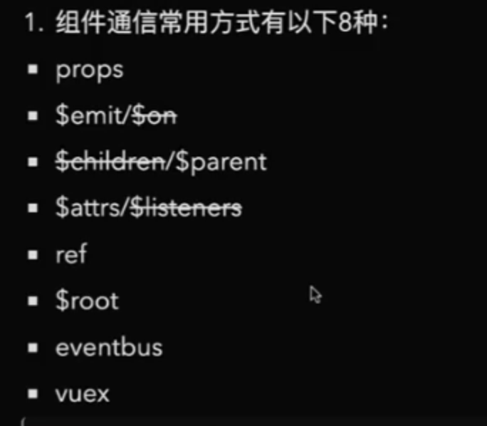
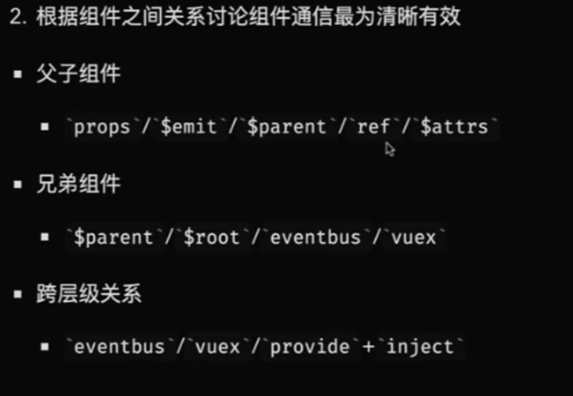

# nanfeiyan-document

## 优质文章记录

Reflect.ownKeys() 获取对象自身可枚举和不可枚举的属性

WeakMap的键是不可枚举的。不提供列出其键的方法,

[Object.groupBy()](https://www.zhangxinxu.com/wordpress/2024/09/js-object-groupby/) 兼容性良好, 可以在项目中使用了


Symbol 不是构造函数,不能new
如果真的想创建 Symbol 对象，可以通过如下方式：
```js
const sym = Object(Symbol(1)); // Symbol {Symbol(1), description: '1'}
typeof sym; // 'object'
Object.prototype.toString.call(sym); // '[object Symbol]'
```

观察者模式和发布订阅模式   vue是观察者模式


Promise.then(() => Promise.resolve(1)).then(() => console.log(2)).then(() => console.log(3));


const fs = require('fs/promises');

其实async函数就是Generator加自动执行器的语法糖  co是一个自执行generator的库


promise的then的第二个参数是接受错误的,
```js
const fs = require('fs/promises');
fs.readFile('test.txt', 'utf8')
  .then(data => {return fs.readFile('test2.txt', 'utf8');}, err => console.log(err))
  .then(null, err => console.log(err));
```


前提条件: 并发是循环, 串行是递归
* Promise.all  必须都成功, 有一个失败就失败 返回的数组是成功的
* Promise.allSettled  allSettled的返回数组是成功的和失败的组合
* Promise.race (rui s) 那个快那个就先返回
* Promise.any  any的返回值是第一个成功的, 有失败的会被忽略, 全部失败就报错


[promises-aplus-tests](https://www.npmjs.com/package/promises-aplus-tests) 测试promise的A+规范

[alova](https://alova.js.org/zh-CN/) 增强请求库

[Tanstack Query](https://tanstack.com/query/latest) 增强请求库

[axios-retry
](https://www.npmjs.com/package/axios-retry) axios的自动重试

[eyedropper-polyfill](https://github.com/iam-medvedev/eyedropper-polyfill) 取色的polyfill

[auto-zustand-selectors-hookr](https://github.com/Albert-Gao/auto-zustand-selectors-hook) 自动生成zustand的selectors

[class-transformer](https://medium.com/@coder_in_austria/using-the-class-transformer-for-better-data-architecture-87448f74037a) 用class进行数据转化。

[fast-safe-stringify](https://www.npmjs.com/package/fast-safe-stringify) JSON.stringify的安全快速序列化替代方案。

[magic-string](https://www.npmjs.com/package/magic-string) 是一个操作字符串和生成source-map的工具

[scroll-snap](https://github.com/lucafalasco/scroll-snap) 整个屏幕滚动

[处理数据精度的问题](https://www.npmjs.com/package/decimal.js)

[聊聊 NPM 镜像那些险象环生的坑](https://mp.weixin.qq.com/s/2ntKGIkR3Uiy9cQfITg2NQ)

[一文搞懂peerDependencies](https://segmentfault.com/a/1190000022435060)

[Hash vs chunkhash vs ContentHash](https://medium.com/@sahilkkrazy/hash-vs-chunkhash-vs-contenthash-e94d38a32208)

[使用CSS将图片转换成模糊(毛玻璃)效果, 所有都兼容](https://www.zhangxinxu.com/wordpress/2013/11/css-svg-image-blur/)

[报告老板，我们的H5页面在iOS11系统上白屏了！](https://juejin.cn/post/6856815533749338125)

[解决JS里面的数据精度问题](https://www.npmjs.com/package/number-precision)

[React组件 显示XX分钟前](https://www.npmjs.com/package/react-timeago)

[浏览器文件下载,download](https://www.npmjs.com/package/js-file-downloader)


[React组件 整页滚动](https://www.npmjs.com/package/react-page-scroller)

[React Context可以嵌套使用, 彼此独立](https://enlear.academy/compound-component-pattern-and-react-context-7f67dd6e4c7a)

[Mac设置redis开机自动启动](https://blog.csdn.net/m0_46689235/article/details/123392460)

[页面引导库](https://driverjs.com/)

[react动画库](https://www.npmjs.com/package/rc-motion)

[架手架](https://github.com/xun082/react-cli)

[React自己开发的组件库](https://github.com/lio-mengxiang/mx-design)

[本地开发组件软连接](https://www.npmjs.com/package/yalc)

[页面滚动动画CSS3驱动](https://www.npmjs.com/package/aos)

[时间的处理函数](https://www.npmjs.com/package/date-fns)

[slugify-处理字符串](https://www.npmjs.com/package/slugify)

[0.2kb的复制粘贴库](https://www.npmjs.com/package/copy-text-to-clipboard)

[xml的快速解析](https://www.npmjs.com/package/fast-xml-parser)

[处理"🏳️‍🌈".length == 6的问题](https://www.npmjs.com/package/grapheme-splitter)

[immutability-helper](https://www.npmjs.com/package/immutability-helper)

[memoize-one函数缓存](https://www.npmjs.com/package/memoize-one)

[re-resizable缩放区域](https://www.npmjs.com/package/re-resizable)

[react-resizable 缩放区域](https://www.npmjs.com/package/react-resizable)

[react-confetti 粒子库](https://www.npmjs.com/package/react-confetti)

[React无限滚动](https://www.npmjs.com/package/react-infinite-scroller)

[React加载各种svg](https://www.npmjs.com/package/react-inlinesvg)

[React的列表的拖拽排序](https://www.npmjs.com/package/react-sortable-hoc)

[react-virtualized](https://www.npmjs.com/package/react-virtualized)

[react-window比react-virtualized更小更快](https://www.npmjs.com/package/react-window)

[react-tiny-virtual-list](https://www.npmjs.com/package/react-tiny-virtual-list)

[react-infinite](https://www.npmjs.com/package/react-infinite)

[resize-observer-polyfill](https://www.npmjs.com/package/resize-observer-polyfill)

[scroll-into-view-if-needed](https://www.npmjs.com/package/scroll-into-view-if-needed)

[linklocal建立本地file:路径](https://www.npmjs.com/package/linklocal)

[clsx代替classNames,更小更快](https://github.com/lukeed/clsx)

[classcat代替classNames,更小更快](https://github.com/lukeed/clsx)
clsx比classcat更好一些, 使用量更高的是clsx

[@feiyan-cli/db](https://github.com/feiyan-Nan/feiyan-cli/blob/master/packages/db/src/index.js)

[tiny-emitter](https://www.npmjs.com/package/tiny-emitter)

[mitt](https://www.npmjs.com/package/mitt) 如果不怎么考虑兼容就可以使用浏览器默认的自定义事件

[custom-event](https://www.npmjs.com/package/custom-event) 处理浏览器自定义事件的一些兼容问题

[ora](https://www.npmjs.com/package/ora) 做控制台logo的

[moment-locales-webpack-plugin](https://www.npmjs.com/package/moment-locales-webpack-plugin) 删除无用的moment本地语言

### Node相关

[fs-extra](https://www.npmjs.com/package/fs-extra)

[del](https://www.npmjs.com/package/del)

[merge2-合并数据流](https://www.npmjs.com/package/merge2)

[through2-对Buffer数据进行遍历处理](https://www.npmjs.com/package/through2)

[camelcase](https://www.npmjs.com/package/camelcase)

[npm-which找npm安装的本地包路径](https://www.npmjs.com/package/npm-which)



[got-一个比较好的请求库](https://www.npmjs.com/package/npm-which)

[nanoid-生成一个不重复的字符串](https://github.com/ai/nanoid/tree/56e8ef93d091fc61f85991332b11c05f2daf928e)

[node-html-parser-解析html非常快](https://www.npmjs.com/package/node-html-parser)

[lru-cache](https://www.npmjs.com/package/lru-cache) 做对象缓存, 越活跃的越不容易被销毁

[userhome](https://www.npmjs.com/package/userhome) 当前用户路径(跨平台)

### Rollup相关

[Rollup全部的插件](https://github.com/rollup/awesome)

### [Vue 文章](./docs/Vue.md)

`process.memoryUsage` 可以检测node占用的内存大小



clinic: Node.js 性能分析套件

> QPS: 用来衡量服务的性能; 每秒能处理的请求数





- [TTFB](https://web.dev/ttfb) 首字节到达
- FP 首次绘制
- [FCP](https://web.dev/fcp) 首次内容绘制
- [LCP](https://web.dev/lcp) 最大内容绘制  衡量加载性能
- FMP 首次有意义的绘制
- DCL DOM内容加载完成
- L 加载完成
- [TTI](https://web.dev/tti) 可交互时间
- [FID](https://web.dev/fid) 首次输入延迟    交互性能
- [TBT](https://web.dev/tbt) 阻塞总时长
- [CLS](https://web.dev/cls) 累积布局偏移   视觉稳定性
- [SI](https://web.dev/si) 速度指数

前端工程化: 模块化, 组件化, 规范化, 自动化

模块化方案: IIFE, CJS, AMD, CMD, UMD, ESM

### v-for和v-if的优先级

在[Vue](https://www.baidu.com/s?rsv_idx=1&wd=Vue&fenlei=256&usm=1&ie=utf-8&rsv_pq=bc653b98001a30ef&oq=v-for%E5%92%8Cv-if%E7%9A%84%E4%BC%98%E5%85%88%E7%BA%A7&rsv_t=68f4uX2ZJC8H3Te5F7vofLixVY9OeHiOEm5q9qkrdEvKcXpPODycE9%2Bs990&sa=re_dqa_zy&icon=1)中，v-for和v-if的优先级取决于版本：

* Vue 2.0。v-for的优先级高于v-if。这意味着，当v-for和v-if同时出现在同一个元素上时，v-for会被先解析，然后才会考虑v-if。这可能导致在渲染少量元素时，每次重新渲染都会遍历整个列表，从而浪费性能。
* Vue 3.0。v-if的优先级高于v-for。在Vue 3中，如果将v-if和v-for同时使用在同一个元素上，可能会出现编译错误，因为v-if依赖于v-for的数据源。

因此，建议在处理v-if和v-for连用的场景时，采取以下措施：

* 在循环渲染之前使用filter或computed计算属性过滤不需要的数据。
* 如果需要根据条件渲染单个项，可以将v-if放在内层元素上。
* 避免在同一元素上同时使用两者，以减少性能浪费

### vue组件通信有哪些

在[Vue](https://www.baidu.com/s?rsv_idx=1&wd=Vue&fenlei=256&usm=1&ie=utf-8&rsv_pq=c8e02b36001efe83&oq=vue%E7%BB%84%E5%BB%BA%E9%80%9A%E4%BF%A1%E6%9C%89%E5%93%AA%E4%BA%9B&rsv_t=ed02rOLjo71OG3KR6Ui3BSaDhYz3BnwK%2ByWRqRMUDHpSPU97wc797MhsoPo&sa=re_dqa_zy&icon=1)中，组件通信主要有以下几种方式：

1. [父子组件](https://www.baidu.com/s?rsv_idx=1&wd=%E7%88%B6%E5%AD%90%E7%BB%84%E4%BB%B6&fenlei=256&usm=1&ie=utf-8&rsv_pq=c8e02b36001efe83&oq=vue%E7%BB%84%E5%BB%BA%E9%80%9A%E4%BF%A1%E6%9C%89%E5%93%AA%E4%BA%9B&rsv_t=ed02rOLjo71OG3KR6Ui3BSaDhYz3BnwK%2ByWRqRMUDHpSPU97wc797MhsoPo&sa=re_dqa_zy&icon=1)之间的通信：

   * 父组件向子组件传递数据：通过自定义属性（props）实现，子组件在模板中使用这些属性来接收数据。
   * 子组件向父组件传递数据：子组件通过触发事件（\$emit）来向父组件发送数据。
2. 兄弟组件之间的通信：

   * 可以使用[EventBus](https://www.baidu.com/s?rsv_idx=1&wd=EventBus&fenlei=256&usm=1&ie=utf-8&rsv_pq=c8e02b36001efe83&oq=vue%E7%BB%84%E5%BB%BA%E9%80%9A%E4%BF%A1%E6%9C%89%E5%93%AA%E4%BA%9B&rsv_t=8530%2FqGf6fksnvOsw1JKM5kHMWlcvW54q8E31hCwi5O3S2Y%2FN183cISajCg&sa=re_dqa_zy&icon=1)（一个简单的发布-订阅模式）来实现兄弟组件之间的数据传递。
3. 祖孙与后代组件之间的通信：

   * 使用[provide](https://www.baidu.com/s?rsv_idx=1&wd=provide&fenlei=256&usm=1&ie=utf-8&rsv_pq=c8e02b36001efe83&oq=vue%E7%BB%84%E5%BB%BA%E9%80%9A%E4%BF%A1%E6%9C%89%E5%93%AA%E4%BA%9B&rsv_t=8530%2FqGf6fksnvOsw1JKM5kHMWlcvW54q8E31hCwi5O3S2Y%2FN183cISajCg&sa=re_dqa_zy&icon=1)和[inject](https://www.baidu.com/s?rsv_idx=1&wd=inject&fenlei=256&usm=1&ie=utf-8&rsv_pq=c8e02b36001efe83&oq=vue%E7%BB%84%E5%BB%BA%E9%80%9A%E4%BF%A1%E6%9C%89%E5%93%AA%E4%BA%9B&rsv_t=8530%2FqGf6fksnvOsw1JKM5kHMWlcvW54q8E31hCwi5O3S2Y%2FN183cISajCg&sa=re_dqa_zy&icon=1)实现依赖注入，祖先组件通过provide定义数据，后代组件通过inject接收数据。
   * 通过[attrs](https://www.baidu.com/s?rsv_idx=1&wd=attrs&fenlei=256&usm=1&ie=utf-8&rsv_pq=c8e02b36001efe83&oq=vue%E7%BB%84%E5%BB%BA%E9%80%9A%E4%BF%A1%E6%9C%89%E5%93%AA%E4%BA%9B&rsv_t=8530%2FqGf6fksnvOsw1JKM5kHMWlcvW54q8E31hCwi5O3S2Y%2FN183cISajCg&sa=re_dqa_zy&icon=1)将数据从祖先组件传递给后代组件。
   * 通过[listeners](https://www.baidu.com/s?rsv_idx=1&wd=listeners&fenlei=256&usm=1&ie=utf-8&rsv_pq=c8e02b36001efe83&oq=vue%E7%BB%84%E5%BB%BA%E9%80%9A%E4%BF%A1%E6%9C%89%E5%93%AA%E4%BA%9B&rsv_t=01b6EkTscx97FdD3%2BVqWJUOJu9s1gPVxsbtaALBXv%2F7xAvFvn8y4owljqqs&sa=re_dqa_zy&icon=1)将数据从后代组件传递给祖先组件。
4. 非关系组件间的通信：

   * 使用根Vue实例（\$root）实现跨级通信，但这不是推荐的做法。
   * 利用[localStorage](https://www.baidu.com/s?rsv_idx=1&wd=localStorage&fenlei=256&usm=1&ie=utf-8&rsv_pq=c8e02b36001efe83&oq=vue%E7%BB%84%E5%BB%BA%E9%80%9A%E4%BF%A1%E6%9C%89%E5%93%AA%E4%BA%9B&rsv_t=01b6EkTscx97FdD3%2BVqWJUOJu9s1gPVxsbtaALBXv%2F7xAvFvn8y4owljqqs&sa=re_dqa_zy&icon=1)或路由参数（query）实现跨页面或跨组件的数据传递。
   * 使用[Vuex](https://www.baidu.com/s?rsv_idx=1&wd=Vuex&fenlei=256&usm=1&ie=utf-8&rsv_pq=c8e02b36001efe83&oq=vue%E7%BB%84%E5%BB%BA%E9%80%9A%E4%BF%A1%E6%9C%89%E5%93%AA%E4%BA%9B&rsv_t=01b6EkTscx97FdD3%2BVqWJUOJu9s1gPVxsbtaALBXv%2F7xAvFvn8y4owljqqs&sa=re_dqa_zy&icon=1)实现全局数据管理，这是Vue官方推荐的全局数据共享方式

     删除线表示vue3没有






lvs是基于在7层协议的传输层, TCP和UDP这层, 所以它不具有用户的cookie, 没法做到基于http分流, 如果需要基于http分流, 我们可以使用nginx进行分流

多数情况下，ES Module可以加载CommonJS

npm和yarn的优化一直在向扁平化迈进

怎么检测是不是undefined类型  `typeof a === 'undefined'`

上岸第一剑，先斩意中人

浏览器三大线程: js引擎线程, GUI渲染线程, 浏览器事件触发线程

声明式
组件化
复用性
可扩展性
跨平台

### 综合测试

Karma
Jest

> 在React18 在setTimeout, Promise, 原生事件中还是会批处理的, 在react低版本中调用几次setState就会执行几次

如果是对象的情况下就会被覆盖
如果是回调函数的情况下就会收集到队列中,

```jsx
this.setState((state) => ({count: state.count + 1}))
this.setState((state) => ({count: state.count + 1}))
this.setState((state) => ({count: state.count + 1}))
// count最终会加3
```

### Json.ts

```typescript
/**
 * Stringify JSON
 * @param v Data to be stringify
 * @returns Stringified JSON, or empty string while encode failed.
 */
export const encodeJSON = (v: unknown): string => {
  try {
    return JSON.stringify(v);
  } catch {
    return '';
  }
};

/**
 * Decode JSON.
 * @param v Stringified JSON.
 * @returns JSON data, or undefined while decode failed.
 */
export const decodeJSON = <T = unknown>(v: string): T | undefined => {
  try {
    return JSON.parse(v);
  } catch {
    return void 0;
  }
};
```

## Object.freeze

```js
// 这里只是简单的不能修改, 但是不报错,如果希望给出一定的提示(报错)可以使用严格模式`'use strict'`
const HOST = {
  url: "http://www.baidu.com",
  port: 443,
};
Object.freeze(HOST);
HOST.port = 80; // 即使这里做了更改, 他也不会变
console.log(HOST.port); // 443
```

ts的编译方式

- ts-loader 编译的时候可以进行类型检查
- babel-loader @babel/preset-typescript 编译的时候不能进行类型检查

**`which node` 查看node的安装目录，
`which`可以查看可执行程序的安装位置**

```js
// getter和setter方法
const nanfeiyan = {
  info: { name: 'nanfeiyan', desc: 'developer' },
  get name() {
    return this.info.name;
  },
  set name(val) {
    this.info.name = val;
  },
};

console.log(nanfeiyan.name);
nanfeiyan.name = 'xiaopohai';
console.log(nanfeiyan.info);
```

### 函数组合

```js
// 函数组合

const add = (x, y) => x + y;
const square = (x) => x * x;

const fn = (x, y) => square(add(x, y));

console.log(fn(2, 3));

// 上面就算是两次函数调用，我们可以把他合并为一个函数
const compose = (fn1, fn2) => (...args) => fn2(fn1(...args));
console.log(compose(add, square)(1, 2));

// 多个函数组合: 中间件的数量是不固定的，我们可以用数组来模拟
const compose1 = (...[first, ...other]) => (...args) => {
  let ret = first(...args);
  other.forEach((fn) => {
    ret = fn(ret);
  });
  return ret;
};

const fn1 = compose1(add, square, square);
console.log(fn1(1, 2));

```

### 查看http协议

`curl -v http://www.baidu.com`

### 通过telnet连接服务器

`telnet localhost 9000`
`telnet baidu.com 80`

# AST

* Common.js ES6 Module CMD AMD UMD这些代码规范之间的相互转化（UMD是AMD和CMD的统一规范）
* webpack rollup 等打包工具
* TypeScript，JSX等转化为JavaScript
* **JavaScript Parser 把js源码转化为抽象语法树的解析器**
* **浏览器会将js源代码通过解析器转化为抽象语法树， 再进一步转化为字节码或者机器码**

> Babel -- 将jSX ---> 转化为js语法(createElement) ---> reactElement --> ReactDom将reactElement转化为浏览器可识辨的html以及相关的js代码

# webpack

webpack要使用tree-shaking功能必须采用ES6 Module规范（ES6 Module可以静态分析）

* require.resolve() 查找某个模块的相对路径`require.resolve('jquery')`

什么叫preset(预设)，预设是插件(plugin)的集合

热加载

webpack懒加载就是通过ES7的`import语法`

### tapable

webpack 本质上是一种事件流机制，他的工作流程就是将各个插件串联起来，而实现这一切的核心就是tapable

`webpack`插件`plugin`由一下组成

* 一个JavaScript命名函数
* 在插件函数的prototype上定义一个apply方法
* 指定一个绑定到webpack自身的事件钩子
* 处理webpack内部实例的特定数据
* 功能完成后调用webpack提供的回调
* 插件的放入顺序是没有关系的

### “在浏览器里，从输入 URL 到页面展示，这中间发生了什么？

1. 首先会检查本地缓存是否缓存了该资源，如果有缓存资源，那直接返回资源给浏览器进程
2. 如果缓存中没有，进行DNS解析（先查找本地host，再到网络上的DNS递归的进行查找，直到查找到根DNS服务器）
3.

# React

`ReactDOM.render()`只会更新变化的dom节点，所以说react性能高

`ReactDOM.render()`中每次都会传入一个不可变元素，但是他是怎么实现**局部**更新的

受控组件： 输入框显示的值由state控制

路走的久了，人往往会迷失－－只知道走，却忘了要往哪儿走，为什么要往那走。

大家似乎都在忙，我们可能花一个小时甚至更久和朋友打电话，却很难面对面的聊五分钟。

我们到底在追寻一种什么东西呢？

THML5的新特性：

1. 语义化标签: 让合适的标签做合适的事情 header footer article aside nav section（定义文档中的节） time
2. 音视频处理
3. canvas/webGL
4. history Api (单页应用)
5. requestAnimationFrame
6. 地理位置
7. web socket
8. ......

代码的优化空间是很小的，大部分的优化都在网络通讯层优化 强缓存和协商缓存

`requestAnimationFrame`浏览器渲染的下一帧

水平居中方案：

1. position+margin负值，
2. 定位之后上下左右都是0 margin: auto;
3. position + transform: translate

Tomcat本身是用java开发的，所以要想跑java代码，运行了Tomcat，相关的java代码就能运行

JDK里面包含了JVM

路由器里面集成了小型的交换机

人会在一段时间里陷入到自己到怪圈中，走不出来，觉得什么都是自己的问题

25的我已经感受到中年危机了，我总活在未来，不快乐的现在，可是我一个人的时候就是无法不想未来啊

需要得知对方的IP地址

数据包中的数据： 源IP和目标IP， 源MAC地址，目标MAC地址

`ping`对方的时候我们就会用ICMP协议

```docker
docker commit [容器id] [镜像名]

docker exec -it [容器id] bash  进入容器

docker rmi
```

```js
// 判断是不是移动端窗口
const isMobileView = () =>
  window.matchMedia('screen and (max-width: 575px)').matches;

export default isMobileView;
```

指数操作符

```js
console.log(2 ** 10)    //1024
console.log(2 ** 5)   //32
```

可选链操作符`( ?. )`允许读取位于连接对象链深处的属性的值，而不必明确验证链中的每个引用是否有效。

空值合并操作符（??）是一个逻辑操作符，当左侧的操作数为 null 或者 undefined 时，返回其右侧操作数，否则返回左侧操作数。

使用对象解构将数组项赋值给变量：

```js
const str = "1997,kangkang,boy,23"
const { 1: name, 2: sex, 0: age } = str.split(',')
console.log(name, sex, age) //kangkang boy 1997
```

注：本例中，2 为 split 之后的数组下标，sex 为指定的变量，值为 boy

创建一个空对象不带任何属性和方法 const obj = {} const obj1 = Object.create(null) //这个对象不会继承Object的任何属性和方法 console.log(obj, obj1);

(a ==2 && a== 4 && a==6) 怎么为 true

```js
// 方法一
const obj = {
  i: 0,
  toString: function() {
    this.i = this.i + 2
    return this.i
  }
}
console.log(obj == 2 && obj == 4 && obj == 6);

// 方法二
const obj = {
  i: 0,
  valueOf: function() {
    this.i = this.i + 2
    return this.i
  }
}
console.log(obj == 2 && obj == 4 && obj == 6);
```

(a === 2 && a === 4 && a === 6) 怎么为 true

```js
let val = 0
Object.defineProperty(window, 'a', {
  get() {
    return ++val
  }
})

console.log(a === 1 && a === 2 && a === 3)  // true
```

同时申明多个变量(目前还不能很好的解释)

```js
var aﾠ = 1;
var a = 2;
varﾠa = 3;
console.log(aﾠ == 1 && a == 2 && ﾠa == 3)  // true
console.log(aﾠ === 1 && a === 2 && ﾠa === 3)  // true
```

最简单的清空和截短数组的方法就是改变 length 属性

```js
const arr = [1, 2, 3, 4, 5, 6, 7, 8, 9]
arr.length = 5
console.log(arr)//[1,2,3,4,5]
arr.length = 0//清空数组
```

逗号运算符 `逗号运算符是二元运算符，它能够先执行运算符左侧的操作数，然后再执行右侧的操作数，最后返回右侧操作数的值。`

```js
let x = 1;
x = (x++, x);
console.log(x);
// expected output: 2
x = (2, 3);
console.log(x);
// expected output: 3
```

使用扩展运算符可以快速扁平化二维数组：

```js
const arr = [1, [2, 3], [4, 5]]
const flatArr = [].concat(...arr)
console.log(flatArr)//[1, 2, 3, 4, 5]
```

不幸的是，上面的技巧只能适用二维数组，但是使用递归，我们可以扁平化任意纬度数组：

```js
const arr = [1, [2, 3], [4, 5, [6, 7, [8, 9]]]]

function flat(arr) {
  let flatArr = [].concat(...arr)
  return flatArr.some(item => Array.isArray(item)) ? flat(flatArr) : flatArr
}

console.log(flat(arr)); // //[1, 2, 3, 4, 5, 6, 7, 8, 9]
```

对象转换为数组

```js
//注意对象必须是以下格式的才可以通过此方式转化为数组
//获取的DOM集合，以及函数的arguments也可以通过此方式转化为数组
var obj = {
  0: 'qian',
  1: 'long',
  2: 'chu',
  3: 'tian',
  length: 4
}

console.log(Array.from(obj));
console.log(Array.prototype.slice.call(obj));
console.log([].slice.call(obj));
console.log([].slice.bind(obj)());
console.log([].slice.apply(obj));
```

取消选取、防止复制

```js
<body onselectstart="return false">
  // JS不允许粘贴
  // onpaste=”return false”
  // JS防止复制
  // oncopy=”return false;” oncut=”return false;”
  // 防止被人 frame
  // if (top.location != self.location)top.location=self.location;
  // 网页禁用另存为
  // '
  <no>
    < iframe src=*.html>
  < /iframe>
</no>
'
// 禁用输入法
```

// 泛型函数 function identity<T>(value: T): T { return value; }

identity<string>('2'); identity<number>('2');

function f<T, U>(value: T, message: U): T { console.log(message); return value; }

f<number, string>(1, 'q');

// 泛型接口 interface IndexPageProps<T, S> { name: T; age: S; }

interface Length { length: number; }

function f1<T extends Length>(arg: T): T { console.log(arg.length); return arg; }

f1(68);

interface Abort<T = number> { name: T; }

const abort: Abort = { name: 2 }; const abort1: Abort<string> = { name: '2' };

头痛医头, 脚痛医脚

### 怎么解决spa页面的首屏空白问题: 可以在index.html中

```js
<div id="app">
  <div id='loading'>加载一个loading, 等着spa渲染结束, 会把loading给替换掉</div>
</div>
```

本地存储 `localStorage`

1. 缓存静态资源文件内筒js/css (百度的M站)
2. 缓存不常变更的接口数据
3. 储存位置信息
4. 浏览在页面的具体位置

Common.js
AMD (异步模块定义)  RequireJS

http2:

1. 多路复用
2. 对头信息进行压缩
3. 采用二进制格式传输数据
4. Service push

## Docker的常用命令

```bash
docker version    # 显示docker的版本信息

docker info       # 显示docker的系统信息, 包括容器和镜像的信息

docker images     # 显示docker镜像

docker image rmi  镜像id   # 删除某个镜像

docker image rmi -f 镜像id   # 强制删除某个镜像

docker image rmi -f $(docker images -aq)  # 删除全部镜像


docker run -it centos /bin/bash  # 运行centos镜像, 并以交互模式进入到镜像中(这种`exit`之后, 容器停止运行)
exit   # 从容器中退出到主机


docker ps  # 查看当前正在运行的容器
docker ps  -a   # 列出所有的容器

### 删除容器
docker rm  容器的id  # 删除容器
docker rm  -f $(docker ps -aq) 删除所有容器

### 启动和停止容器的操作
docker start 容器id   # 启动容器
docker restart 容器id # 重新启动容器
docker stop  容器id   # 停止当前正在运行的容器
docker kill 容器id    # 强制停止当前容器

## 容器启动后, 进去容器, 退出后容器继续运行
docker exec -it abc29f212590(`容器id`) /bin/bash   # 启动一个新的进程,重新在里面操作
docker attach 容器id  #进入正在执行的终端, 不会启动新的进程

docker run -d -p 80:80 nanfeiyan # 后台运行
```

### 查看容器中进程信息 ps

```shell
docker top 容器id

# 查看容器的一些基本信息
docker inspect 容器id
```

### 从容器拷贝文件到主机上

```shell
docker cp 容器id:容器内路径  目的主机的路径
```

dom转化图片 DOM to Image

1. 编译器:  是指高级语言到低级语言的转换工具
2. 转译器:  高级语言到高级语言的转换工具

babel的转义过程: parse ===> transform ===> generate
