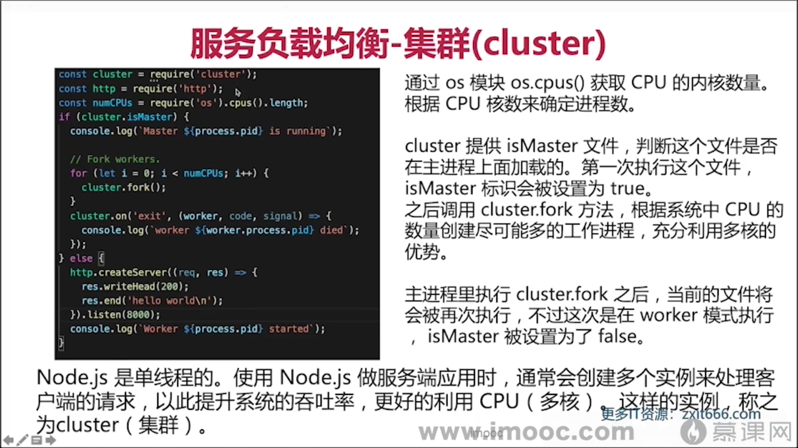

# nanfeiyan-document

### [Vue 文章](./docs/Vue.md)

## Object.freeze

```js
// 这里只是简单的不能修改, 但是不报错,如果希望给出一定的提示(报错)可以使用严格模式`'use strict'`
const HOST = {
  url: 'http://www.baidu.com',
  port: 443,
};
Object.freeze(HOST);
HOST.port = 80; // 即使这里做了更改, 他也不会变
console.log(HOST.port); // 443
```

ts 的编译方式

- ts-loader 编译的时候可以进行类型检查
- babel-loader @babel/preset-typescript 编译的时候不能进行类型检查

**`which node` 查看 node 的安装目录，
`which`可以查看可执行程序的安装位置**

```js
// getter和setter方法
const nanfeiyan = {
  info: { name: 'nanfeiyan', desc: 'developer' },
  get name() {
    return this.info.name;
  },
  set name(val) {
    this.info.name = val;
  },
};

console.log(nanfeiyan.name);
nanfeiyan.name = 'xiaopohai';
console.log(nanfeiyan.info);
```

### 函数组合

```js
// 函数组合

const add = (x, y) => x + y;
const square = (x) => x * x;

const fn = (x, y) => square(add(x, y));

console.log(fn(2, 3));

// 上面就算是两次函数调用，我们可以把他合并为一个函数
const compose = (fn1, fn2) => (...args) => fn2(fn1(...args));
console.log(compose(add, square)(1, 2));

// 多个函数组合: 中间件的数量是不固定的，我们可以用数组来模拟
const compose1 = (...[first, ...other]) => (...args) => {
  let ret = first(...args);
  other.forEach((fn) => {
    ret = fn(ret);
  });
  return ret;
};

const fn1 = compose1(add, square, square);
console.log(fn1(1, 2));
```

### 查看 http 协议

`curl -v http://www.baidu.com`

### 通过 telnet 连接服务器

`telnet localhost 9000`
`telnet baidu.com 80`

# AST

- Common.js ES6 Module CMD AMD UMD 这些代码规范之间的相互转化（UMD 是 AMD 和 CMD 的统一规范）
- webpack rollup 等打包工具
- TypeScript，JSX 等转化为 JavaScript

- **JavaScript Parser 把 js 源码转化为抽象语法树的解析器**
- **浏览器会将 js 源代码通过解析器转化为抽象语法树， 再进一步转化为字节码或者机器码**

> Babel -- 将 jSX ---> 转化为 js 语法(createElement) ---> reactElement --> ReactDom 将 reactElement 转化为浏览器可识辨的 html 以及相关的 js 代码

# webpack

webpack 要使用 tree-shaking 功能必须采用 ES6 Module 规范（ES6 Module 可以静态分析）

- require.resolve() 查找某个模块的相对路径`require.resolve('jquery')`

什么叫 preset(预设)，预设是插件(plugin)的集合

热加载

webpack 懒加载就是通过 ES7 的`import语法`

### tapable

webpack 本质上是一种事件流机制，他的工作流程就是将各个插件串联起来，而实现这一切的核心就是 tapable

`webpack`插件`plugin`由一下组成

- 一个 JavaScript 命名函数
- 在插件函数的 prototype 上定义一个 apply 方法
- 指定一个绑定到 webpack 自身的事件钩子
- 处理 webpack 内部实例的特定数据
- 功能完成后调用 webpack 提供的回调
- 插件的放入顺序是没有关系的

### “在浏览器里，从输入 URL 到页面展示，这中间发生了什么？

1. 首先会检查本地缓存是否缓存了该资源，如果有缓存资源，那直接返回资源给浏览器进程
2. 如果缓存中没有，进行 DNS 解析（先查找本地 host，再到网络上的 DNS 递归的进行查找，直到查找到根 DNS 服务器）
3.

# React

`ReactDOM.render()`只会更新变化的 dom 节点，所以说 react 性能高

`ReactDOM.render()`中每次都会传入一个不可变元素，但是他是怎么实现**局部**更新的

受控组件： 输入框显示的值由 state 控制

路走的久了，人往往会迷失－－只知道走，却忘了要往哪儿走，为什么要往那走。

大家似乎都在忙，我们可能花一个小时甚至更久和朋友打电话，却很难面对面的聊五分钟。

我们到底在追寻一种什么东西呢？

THML5 的新特性：

1. 语义化标签: 让合适的标签做合适的事情 header footer article aside nav section（定义文档中的节） time
2. 音视频处理
3. canvas/webGL
4. history Api (单页应用)
5. requestAnimationFrame
6. 地理位置
7. web socket
8. ......

代码的优化空间是很小的，大部分的优化都在网络通讯层优化 强缓存和协商缓存

`requestAnimationFrame`浏览器渲染的下一帧

`setState只有在合成事件和生命周期中是异步的, 在原生事件中和setTimeout中都是同步的，`

css-modules 也是处理 react 样式的的一种很好的方式

水平居中方案：

1. position+margin 负值，
2. 定位之后上下左右都是 0 margin: auto;
3. position + transform: translate

Tomcat 本身是用 java 开发的，所以要想跑 java 代码，运行了 Tomcat，相关的 java 代码就能运行

JDK 里面包含了 JVM

路由器里面集成了小型的交换机

人会在一段时间里陷入到自己到怪圈中，走不出来，觉得什么都是自己的问题

25 的我已经感受到中年危机了，我总活在未来，不快乐的现在，可是我一个人的时候就是无法不想未来啊

需要得知对方的 IP 地址

数据包中的数据： 源 IP 和目标 IP， 源 MAC 地址，目标 MAC 地址

`ping`对方的时候我们就会用 ICMP 协议

```docker
docker commit [容器id] [镜像名]

docker exec -it [容器id] bash  进入容器

docker rmi
```

```js
// 判断是不是移动端窗口
const isMobileView = () => window.matchMedia('screen and (max-width: 575px)').matches;

export default isMobileView;
```

指数操作符

```js
console.log(2 ** 10); //1024
console.log(2 ** 5); //32
```

可选链操作符`( ?. )`允许读取位于连接对象链深处的属性的值，而不必明确验证链中的每个引用是否有效。

空值合并操作符（??）是一个逻辑操作符，当左侧的操作数为 null 或者 undefined 时，返回其右侧操作数，否则返回左侧操作数。

// 泛型函数 function identity<T>(value: T): T { return value; }

identity<string>('2'); identity<number>('2');

function f<T, U>(value: T, message: U): T { console.log(message); return value; }

f<number, string>(1, 'q');

// 泛型接口 interface IndexPageProps<T, S> { name: T; age: S; }

interface Length { length: number; }

function f1<T extends Length>(arg: T): T { console.log(arg.length); return arg; }

f1(68);

interface Abort<T = number> { name: T; }

const abort: Abort = { name: 2 }; const abort1: Abort<string> = { name: '2' };

```js
// React性能优化
shouldComponentUpdate(); // 返回true就更新， 返回false就不更新

PureComponent(浅比较);

React.memo()(浅比较);
```


**在父组件也可以调用子组件的相关方法，并给他传递相关的参数，（函数式组件需要借助`forwardRef`和`useImperativeHandle`）**

`useEffect`的回调函数中不能返回`promise`

DNS 查询就用的是 UDP 传输 TCP 传输 http

1. 滚动加载： 在滚动列表的后面
2. 图片懒加载
3. 骨架屏

并发限制指的是: 每个时刻并发执行的 promise 数量是固定的

```js
// js判断一个字符串是否是回文字符串
// 回文字符串：即字符串从前往后读和从后往前读字符顺序是一致的。
// 如：字符串abccba，从前往后读是a-b-c-c-b-a；从后往前读也是a-b-c-c-b-a
function palindrome(str) {
  return str === Array.from(str).reverse().join('');
}

console.log(palindrome('abcba'));
```

1. React17 中, React 会自动替换 JSX 为 js 对象
2. js 对象即 Vdom, 它能够完整描述 dom 结构
3. ReactDOM.render(vdom, container) 可以将`vdom`转化为 dom 并添加到 container 中
4. 实际上, 转化过程需要经过一个 diff 过程

#### diff 策略

1. 同级比较,web UI 中 DOM 节点跨层级的移动操作特别少, 可以忽略不计
2. 节点类型不同的会重新生成新的树形结构
3. 如果节点类型相同的情况下,他会通过比较`key`来保持不同渲染下元素可以保持稳定

前端路由缺点: SEO, 使用浏览器的前进后退会刷新页面

```js
history: history.pushState(), history.replaceState(), history模式下用popstate监听路由变化;

hash: window.location.hash = 'index';
使用onhashchange来监听hash变化;

requestIdleCallback();
```

## 解析弹性盒 flex,按比例缩放后是否是一定比例的

### 子元素有固定宽度

请看下面的代码

```html
<!DOCTYPE html>
<html lang="en">
  <head>
    <meta charset="UTF-8" />
    <title>Title</title>
    <style>
      * {
        margin: 0;
        padding: 0;
      }

      .con {
        width: 100%;
        height: 100px;
        display: flex;
        border: 1px solid #333;
      }

      .con > div {
        width: 200px;
        height: 100%;
        flex-grow: 1;
        text-align: center;
        background-color: orange;
      }
    </style>
  </head>
  <body>
    <div class="con">
      <div></div>
      <div style="flex-grow: 2; background-color: #61dafb"></div>
      <div></div>
    </div>
  </body>
</html>
```

> 按照我原来的理解, `flex-grow: 2`应该是`flex-grow: 1`的两倍, 不知道有没有小伙伴和我想的一样的 😀

如果父元素的宽度是 1440, 那么本应该是这样的

1. 第一个 div: 1440/4=360
2. 第一个 div: 1440/2=720
3. 第一个 div: 1440/4=360

**但是**实际是这样的,第一个 div: 410, 第二个:620, 第三个: 410, 呐呢~~~~


经过我查阅相关资料了解到:
**弹性盒子是基于总宽度减去子元素本身占据的宽度, 剩下的宽度, 按照弹性盒子的比例去分配, 比如总宽度是 1440, 子元素占据的宽度`200*3=600` 所以可以弹性的宽度是`1440-200*3=840`,
剩下的宽度分成 4 份, `840/4=210`, 所以第一个 div: `200+210=410`, 第二个 div: `200+210*2=620` 第三个 div 和第一个一样`200+210=410`**

这就对上了嘛!!! [开心 ing]

### 把子元素宽度去掉

如果这时我把子元素的宽度取消掉

```html
<!DOCTYPE html>
<html lang="en">
  <head>
    <meta charset="UTF-8" />
    <title>Title</title>
    <style>
      * {
        margin: 0;
        padding: 0;
      }

      .con {
        width: 100%;
        height: 100px;
        display: flex;
        border: 1px solid #333;
      }

      .con > div {
        /*width: 200px;*/
        height: 100%;
        flex-grow: 1;
        text-align: center;
        background-color: orange;
      }
    </style>
  </head>
  <body>
    <div class="con">
      <div></div>
      <div style="flex-grow: 2; background-color: #61dafb"></div>
      <div></div>
    </div>
  </body>
</html>
```

结果: (这次就完美的实现了等分)


### 把子元素不给固定宽度但是有文字

```html
<!DOCTYPE html>
<html lang="en">
  <head>
    <meta charset="UTF-8" />
    <title>Title</title>
    <style>
      * {
        margin: 0;
        padding: 0;
      }

      .con {
        width: 100%;
        height: 100px;
        display: flex;
        border: 1px solid #333;
      }

      .con > div {
        /*width: 200px;*/
        height: 100%;
        flex-grow: 1;
        text-align: center;
        background-color: orange;
      }
    </style>
  </head>
  <body>
    <div class="con">
      <div>11111111</div>
      <div style="flex-grow: 2; background-color: #61dafb">2222222</div>
      <div>3333333</div>
    </div>
  </body>
</html>
```

同样和第一个情况一样, 等分要减去子元素本身占据的空间, 然后将剩余的空间进行等分


### 元素居中

1. flex 布局
2. 父元素 flex 布局, 子元素 margin: auto
3. margin:auto 实现绝对定位元素的居中,四个方向都为 0
4. 绝对定位 left: 50%, top: 50%, 子元素通过负 margin 或者 transform: translate(-50%, -50%)

闭包的应用场景: 防抖节流, 模块化,


> 马斯克说过这样的一句话，我现在不和别人争吵了 ，因为我开始意识到，每个人只能站在自己的认知角度上去思考，所以有人和你说地球是方的，你只需要笑着对他说 是的，你真厉害。

### nginx

`nginx`中`location`的命中过程是这样的:

1. 先判断精准命中, 如果命中, 立即返回结果并结束解析
2. 判断普通命中,如果有多个命中, 记录下来最长的命中结果(注意: 只记录但不结束, 最长的为准)
3. 继续判断正则表达式的解析结果, 按配置的正则表达式顺序为准, 又上到下开始匹配,一旦匹配成功一个, 立即返回结果,并结束解析过程
4. 普通命中顺序无所谓, 是因为按命中的长度来确定的, 正则命中, 顺序有所谓, 因为是从前往后命中
5. 精准命中>普通命中>正则命中

absorb: 吸收, 吸引, 使...全神贯注
absorb in 集中注意力干某事
absorption: 吸收

acceptance speech 获奖感言, 致辞

abolish: 废除 abolition:

above all 首先, 最重要的是

reckless 鲁莽

fade away 逐渐消失

sandbeach 沙滩

drunkenness 酒醉

manpower 劳动力, 人力

manpower shortage 劳动力短缺

abundant 大量的, 充足的

proof 证据

unclear 不清楚, 含糊的, 难以理解的

abundant 丰富的,

abundance 丰富 (n)

abuse 滥用, 辱骂, 虐待

abuser 滥用者, 施虐者

academy 学院, 研究生

academic 学院的, 学术的(adv), 大学生, 大学老师(n)

excels 优秀, 胜过他人, 擅长

PE 体育课

is expected to 预计

grim 严峻的 糟糕的 严厉的

acceptance speech 发表感 致辞

accommodate 是适应, 容纳

guidelines 指导方针

nationwide 全国范围的, 全国性的

encounter 遇到, 偶然碰到

every time 每当

willpower 毅力

surpasses 胜于, 优于, 超越;

perhaps 也许, 可能 假定, 猜想

tiles 瓷砖

neglect 忽视

manners 礼貌 bad manners 坏习惯

flaw 缺点 缺陷 flaws

gain 收获, 增加

emergency access 紧急通道

as a result 因此

accident 事故, 意外 (偶然或者意外发生的不幸运的事情)
traffic accident 交通事故

by accident 偶然意外
car accident 车祸 交通事故

that is a pity 好可惜

accommodate with 向...供应 提供
**then()只要有返回值,那么他就会进入到一个成功态的 promise, 如果 throw 抛出错误那么就会进入到失败态, 如果 then 方法里面传递的不是回调函数是会被忽略掉的**

```js
let promise2 = new Promise((resolve, reject) => {
  reject(33);
});

// 如果then方法里面传递的不是回调函数是会被忽略掉的
promise2.then(null, undefined).then(
  (res) => console.log('promise2 已完成', res),
  (err) => {
    console.log('promise2 已拒绝', err);
  }
);

// promise2 已拒绝 33

// then()只要有返回值,那么他就会进入到一个成功态的promise
promise2
  .then(null, () => 123)
  .then(
    (res) => console.log('promise2 已完成', res),
    (err) => {
      console.log('promise2 已拒绝', err);
    }
  );
// 'promise2 已完成', 123
```

## this 的指向问题(其实说的是函数分了几类)

1. 对于直接调用的普通函数来说, 不管函数放在哪, `this`都指向`window`
2. 函数作为对象的属性, 此时谁调用指向谁
3. 作为构造函数, this 指向当前类的一个实例
4. 箭头函数没有自己的`this`需要看外层函数, 如果有, 外层函数的 this 就是内层箭头函数的 this
5. 使用 call, apply, bind 改变 this 指向

206 部分内筒

自研发脚手架

1. 为什么全局安装`@vue/cli`后会添加命令为`vue`? //实际叫什么取决于 package.json 里面的 bin 里面的配置
2. 全局安装`@vue/cli`时发生了什么 // 将包安装到全局的 node_modules 的目录中, 并且会创建一个软连接,
3. 执行 vue 命令的时候发生了什么? 为什么 vue 指向一个 js 文件, 我们却可以直接通过 vue 命令去执行他 //

脚手架

今天看了《你的婚礼》
人一生中会遇到很多人，但是初恋只有一个。
从认识你,到现在我依旧很喜欢你,可能你不是哪个最优秀的, 但在我这里, 你永远都是很完美的一个人,有女性的温柔,有自己的个性,最近朋友也给介绍认识一些人, 但是我心里装着一个人, 怎么感觉还是不能接受. 我想着这需要时间去淡化吧.

最近思考了很多,人就是这样一步一步的错过的, 如果咱两晚一点认识该多好, 认识你这一年多时间里, 经历也是蛮多的, 也让你跟着我吃了很多的苦, 在此,我想对你说声对不起, 谢谢你在我最困难的时候还陪伴着我, 谢谢. 今年应该还一波房贷就不会再还了, 我想未来的生活质量也会变的高一些,人的心态也会变化一些, 可能在之前我说了一些伤人的话,(慢慢的我认识到这些话可能都是一些"语言暴力") 致使你对我也慢慢的失去了希望, 可能是在一段时间里, 大家都会有烦躁或者是思想上的变化, 但是我想这一切,我都是想让你变成我认为的哪个她, 把一些主观的点强加到了你的身上, 不过, 还是有很多美好的瞬间的, 我想这个美好的瞬间还是多于那些不好的过去的, 虽然你现在看到这些东西会烦吧! 也许我是让自己心安一些吧!

余生活着就是想她，愿这辈子短一点
