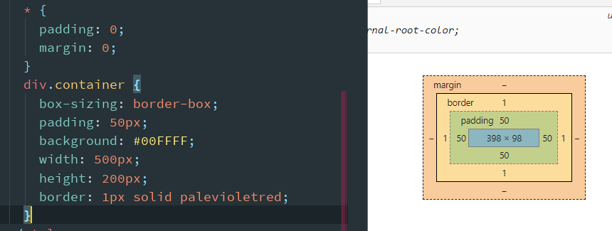
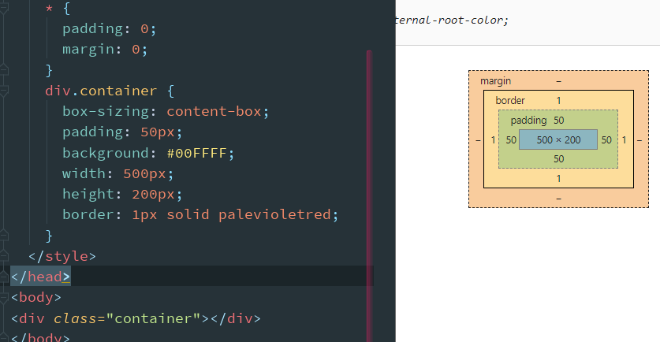
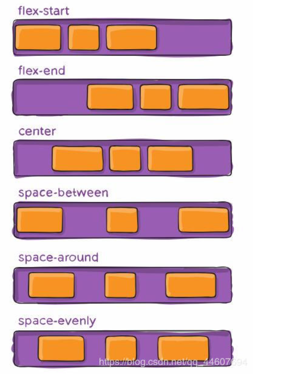

`:nth-child(n)` 是选择父元素的第n个子元素。 

`footer div:nth-child(n+2)`  表示footer 元素下的div 跳过第一个之后的所有元素(这里的n都是整数)

`:nth-of-type(n)` 是选择父元素的第n个**同类型**的子元素


flex下的项目: 

- 不能使用float与clear规则
- 弹性元素均为块元素
- **绝对定位**的弹性元素不参与弹性布局

###    

### box-sizing

box-sizing: border-box;:


box-sizing: content-box;



## justify-content容器属性

```css
.container {
  justify-content: flex-start | flex-end | center | space-between | space-around | space-evenly;
}
```

