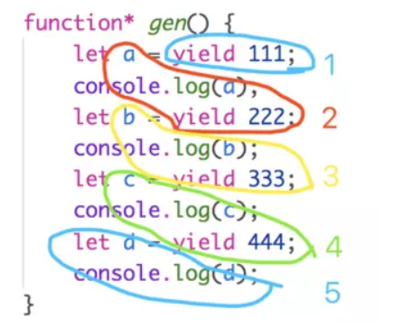

## 1. 异步

> 所谓"异步" 简单说就是一个任务分成两段, 先执行第一段, 然后转而执行其他任务, 等做好了准备, 再回过头来执行第二段.


### 高阶函数
函数既可以作为**参数**,也可以作为**返回值**

高阶函数的英文名叫 Higher-Order Function，熟悉 React 的朋友应该知道高阶组件 Higher-Order Component。没错，React 的高阶组件本质上就是高阶函数。

那么，什么是高阶函数呢？

高阶函数源自于函数式编程,是函数式编程的基本技术。

那么，JS作为一门“一切皆为对象”的语言，是如何拥有函数式编程的能力呢？

是因为在JS中函数是一等公民，即函数可以被赋值给变量，被变量引用，这便使得函数可以作为参数，在其他函数间相互传递：

#### 函数当一个参数传递
```js
/** 
 * 数值转换
 * @param {Number} val 要被处理的数值
 * @param {Function} fn 处理输入的val
 * @return {Number || String}
 */
const toConvert = function(val, fn) {
    return fn(val);
};

const addUnitW = function(val) {
    return val + 'W';
};

toConvert(123.1, Math.ceil); // 124
toConvert(123.1, addUnitW); // "123.1W"
```
#### 函数当一个返回值
```js
// 判断一个变量的类型

function isType(type) {
  return function (param) {
    return Object.prototype.toString.call(param) == `[object ${type}]`
  }
}
let isString = isType('String')
let isArray = isType('Array')
console.log(isString('nan')); // true
console.log(isArray({}));  // false
```
#### 函数即做参数又做返回值
假设有这样一个需求, 有个函数需要连续调用三次才可以执行, 你可以提前思考一下怎么写
```js
function eat() {
  console.log("吃完了");
}
function after(time, fn) {
  let count = 0
  return function () {
    if(count++ === time) {
      fn()
    }
  }
}
let newEat = after(3, eat)
newEat()
newEat()
newEat()
```
### 异步编程的语法目标, 就是怎么样让它更像同步编程一样

* 回调函数
* 事件监听
* 发布订阅
* Promise/A+ 和 生成器函数
* async/await

#### 回调
所谓回调函数, 就是把任务的第二段单独写在一个函数里面, 等到重新执行这个任务的时候, 就直接调用这个函数

```js
fs.readFile('某个文件', function(err, data) {
  if(err) throw err
  console.log(data)
})
```
回调函数的问题:

1. 无法捕获错误 try catch
2. 不能return
3. 回调地狱 (如先读取A接口的数据，再根据A接口返回的数据去读取B接口的数据再根据B的返回的内容读取C..)

#### 事件监听


#### 发布订阅

```js
// 利用发布订阅的模式, 读取html模板和数据, 当两者都存在时输出
const Event = require('events')
const fs = require('fs')

let eve = new Event()
let html = {}

eve.on('ready', function (key, value) {
  html[key] = value
  // 当两个结果都有了
  if(Object.keys(html).length == 2) {
    console.log(html);
  }
})  // 注册

fs.readFile('./template.txt','utf8', function (err, template) {
  eve.emit('ready', 'data', template)
})
fs.readFile('./data.txt', 'utf8', function (err, data) {
  eve.emit('ready', 'data', data)
})


/********************************************/
// 以上这样方式简写的形式可以用一个"哨兵函数来监听"

const fs = require('fs')
/*
let html = {}
// 哨兵函数
function done (key, value) {
  html[key] = value
  if(Object.keys(html).length == 2) {
    console.log(html);
  }
}
**/
// 给哨兵函数封装一下
/**********************************************/
function reader (length, fn) {
  let html = {}
  return function (key, value) {
    html[key] = value
    if(Object.keys(html).length == length) {
      fn(html)
    }
  }
}
let done = reader(2, function (html) {
  console.log(html)
})
/**********************************************/
fs.readFile('./data.txt','utf8', function (err, template) {
  done('template', template)
})
fs.readFile('./demo.txt', 'utf8', function (err, data) {
  done('data', data)
})
```


#### 生成器

生成器是一个函数, 可以用来生成迭代器

Generator 函数是 ES6 提供的一种异步编程解决方案，整个 Generator 函数就是一个封装的异步任务，或者说是异步任务的容器。异步操作需要暂停的地方，都用 yield 语句注明。

```js
function* gen() {
    let a = yield 111;
    console.log(a);
    let b = yield 222;
    console.log(b);
    let c = yield 333;
    console.log(c);
    let d = yield 444;
    console.log(d);
}
let t = gen();
//next方法可以带一个参数，该参数就会被当作上一个yield表达式的返回值
t.next(1); //第一次调用next函数时，传递的参数无效
t.next(2); //a输出2;
t.next(3); //b输出3; 
t.next(4); //c输出4;
t.next(5); //d输出5;
```
为了让大家更好的理解上面代码是如何执行的，我画了一张图，分别对应每一次的next方法调用:



### Promise

手写promise
```js
Promise.all的原理

function gen(times, fn) {
  return function (i, data) {
    if(i+1 == times) {
      fn(data)
    }
  }
}

Promise.all = function (promises) {
  return new Promise(function (resolve, reject) {
    let done = gen(promises.length, resolve)
    for (let i = 0; i < promises.length; i++) {
      promises[i].then(function (data) {
        done(i, data)
      }, reject)
    }
  })
}

Promise.race的原理:
Promise.race = function (promises) {
  return new Promise(function (resolve, reject) {
    for (let i = 0; i < promises.length; i++) {
      promises[i].then(resolve, reject)
    }
  })
}
```


设为 Flex 布局以后，子元素的 float 、 clear 和 vertical-align 属性将失效